<div align="center">
  

  <h1>Wrapup</h1>

  **A privacy-first, fully offline voice & meeting notes app.**

  Wrapup listens to meetings and dictation, transcribes and summarizes them
  entirely on-device, links recordings to your calendar, and tracks action
  items through to completion — without a single byte of audio, transcript,
  or summary ever leaving your phone.
</div>

---

## What Wrapup does

- **Calendar-aware meeting detection** — reads your device calendar, shows
  today's events, and uses a heuristic (attendee count, conferencing links,
  keywords) to guess which events are meetings worth recording. You always
  confirm before anything records.
- **Consent-first recording** — an explicit consent screen and a persistent,
  unmissable recording indicator, because this app listens to conversations
  and that deserves to be treated seriously, not buried in a toggle.
- **On-device transcription** — Whisper (`whisper.rn`) runs the audio-to-text
  pipeline locally. No cloud ASR, ever.
- **On-device summarization & action items** — a local LLM (`llama.rn`) turns
  transcripts into a plain-language summary and a JSON-schema-constrained
  list of action items (owner/due-date extracted only when the transcript
  states them explicitly).
- **Per-meeting AI chat** — ask follow-up questions about a specific meeting
  ("what did we decide about the launch date?") and get answers grounded in
  that meeting's transcript, generated entirely offline.
- **Todos that don't get lost** — action items are linked back to their
  source meeting, with local reminders as their due date approaches or
  passes, and a tab badge that surfaces what's actually overdue or due soon
  (not just a raw open-item count).
- **Two ways to find a past recording** — a calendar-style view where
  recordings sit on their original event, and a Library tab that full-text
  searches transcripts and summaries, not just titles.
- **Your model, your choice** — pick a Fast / Balanced / Best-quality model
  during onboarding, download it with a resumable, Wi-Fi-aware progress bar,
  and switch or delete it later from Settings.

> **Current build status:** the full pipeline runs end-to-end today —
> calendar integration, consent-gated recording, local audio capture/playback
> (with a real audio-reactive waveform scrubber), on-device transcription
> (`whisper.rn`), on-device summarization/action-item extraction/meeting
> chat (`llama.rn`), the SQLite-backed data layer for meetings/todos/
> summaries/chat, Library full-text search, todo reminders (local
> notifications, configurable lead time), and the full onboarding/model-
> download/settings UI. The screenshots below are captured from that build
> running on an iOS simulator, not design mockups. A few Settings toggles
> are still cosmetic-only and not yet wired to real behavior: **auto-record
> detected meetings**, **require Face ID to open**, and **export my data**.

## Privacy, by construction

The recording → transcription → summarization pipeline **never makes a
network call**, under any circumstances — no cloud ASR fallback, no cloud
LLM fallback, no analytics on meeting content. The only network activity
anywhere in the app is downloading the model weight files themselves (a
static asset, not your data) and optional app-infrastructure calls like
update checks — both clearly separated from anything that touches audio,
transcripts, or summaries.

## Screens

Real screenshots from the custom dev client running on an iOS simulator —
not design mockups. The meeting summary/chat screenshots below are from an
actual recording, transcribed and summarized on-device by the Fast-tier
model; everything else uses the repo's local dev seed data.

<table>
<tr>
<td align="center">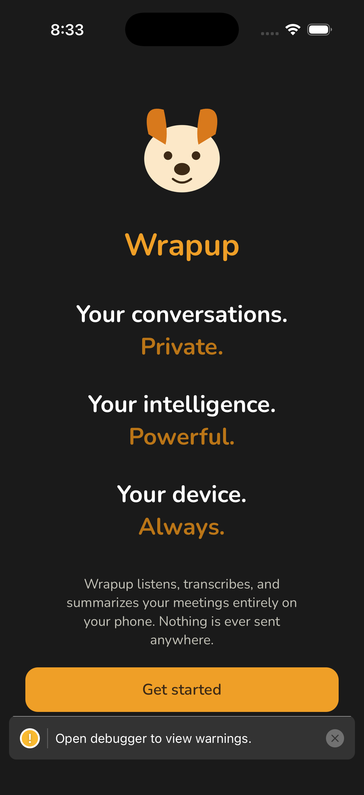<br/>Welcome</td>
<td align="center">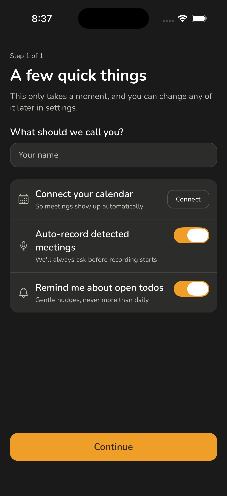<br/>Onboarding</td>
<td align="center">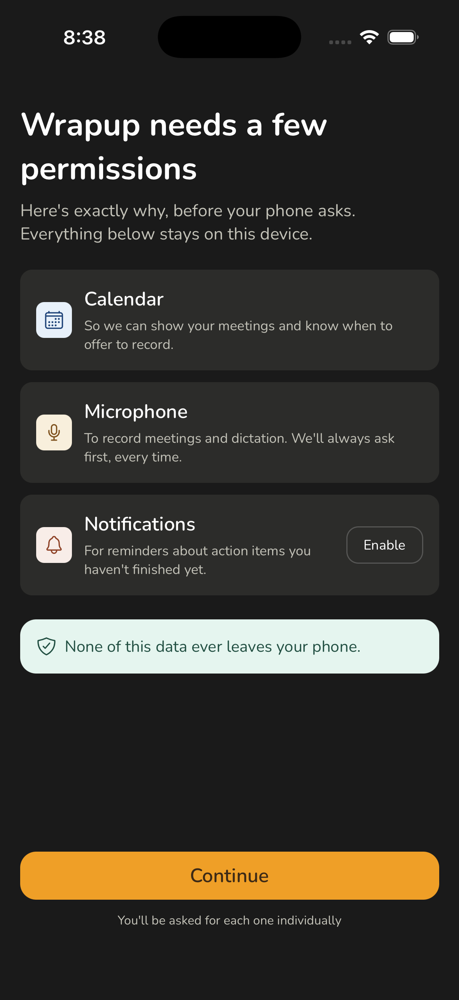<br/>Permissions</td>
<td align="center">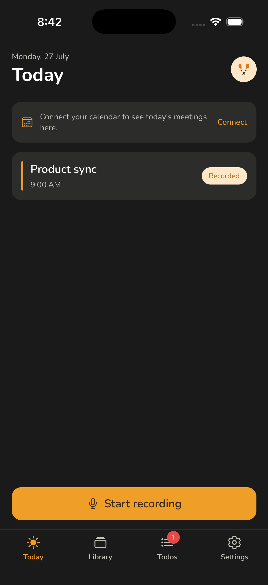<br/>Today</td>
</tr>
<tr>
<td align="center">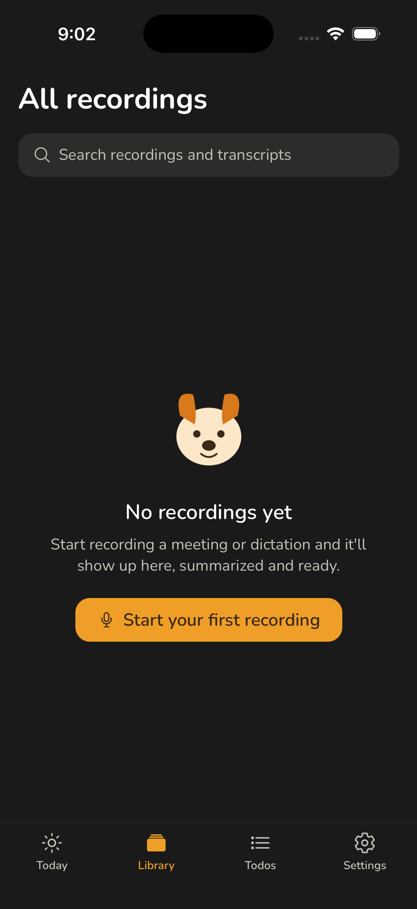<br/>Empty state</td>
<td align="center">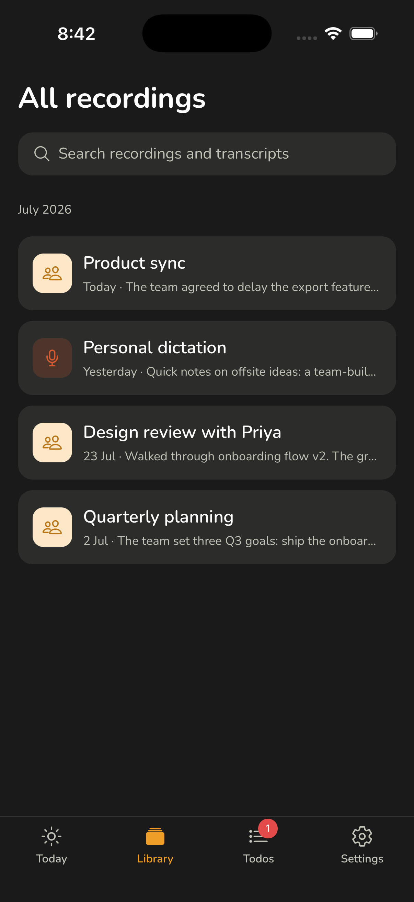<br/>Library</td>
<td align="center">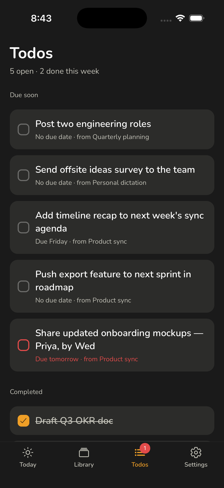<br/>Todos</td>
<td align="center">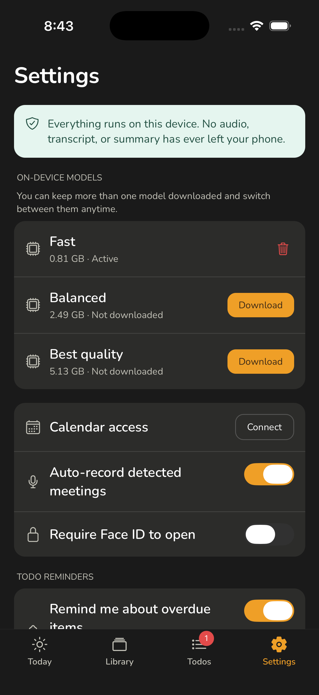<br/>Settings</td>
</tr>
<tr>
<td align="center">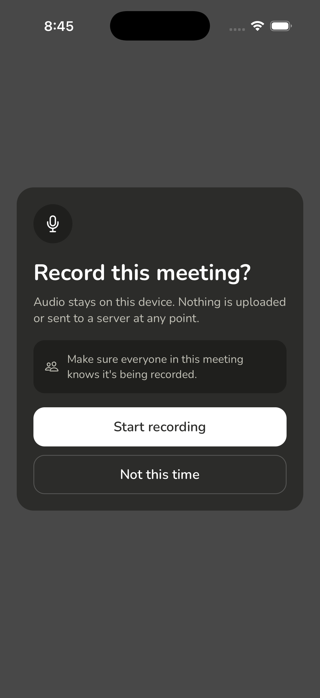<br/>Record consent</td>
<td align="center">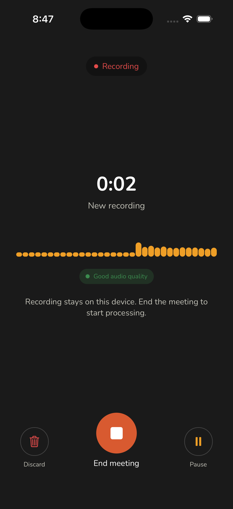<br/>Recording</td>
<td align="center">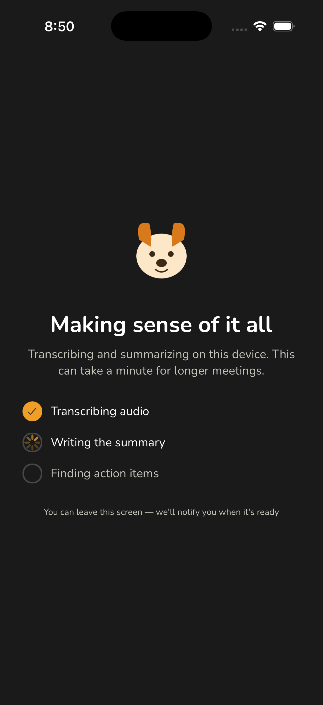<br/>Processing</td>
<td align="center">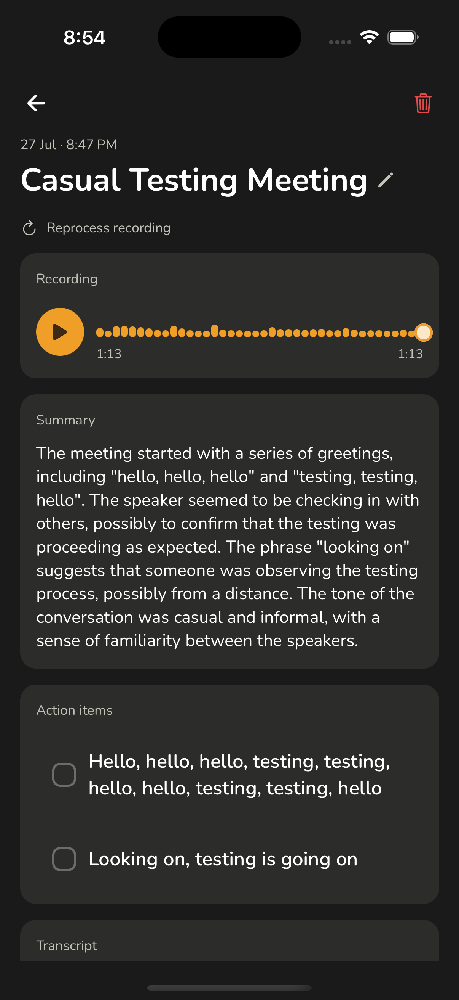<br/>Summary</td>
</tr>
<tr>
<td align="center">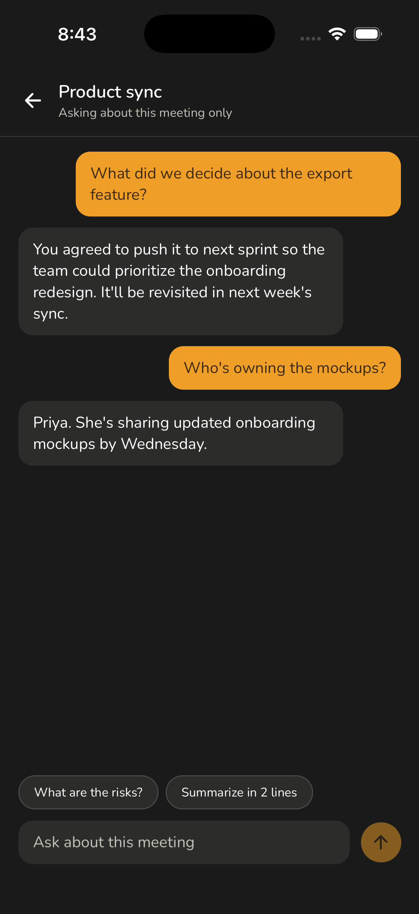<br/>Meeting chat</td>
<td align="center">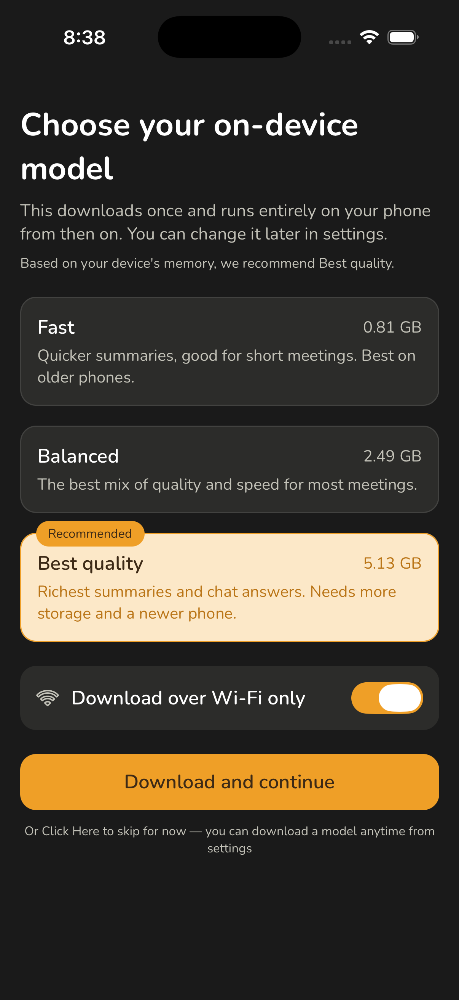<br/>Choose model</td>
<td align="center">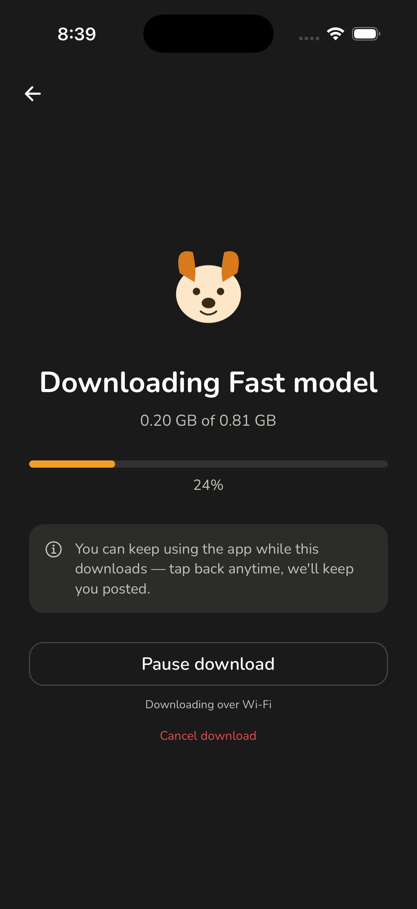<br/>Download model</td>
</tr>
</table>

## Tech stack

| Concern | Library |
|---|---|
| App shell / routing | Expo (custom dev client), Expo Router |
| UI | React Native, TypeScript (strict), NativeWind |
| State | Zustand |
| Structured data | expo-sqlite (meetings, transcripts, summaries, todos, chat — with an FTS5 index for Library search) |
| Lightweight prefs | AsyncStorage (onboarding flag, reminder preferences — never meeting content) |
| Calendar | expo-calendar (read-only) |
| Recording & playback | expo-audio |
| Local notifications | expo-notifications |
| On-device ASR | whisper.rn |
| On-device LLM | llama.rn |

This app **requires a custom Expo dev client** — it cannot run inside Expo
Go, because it depends on native modules (whisper.rn, llama.rn, and others)
that aren't part of the Expo Go sandbox.

## Architecture

```text
src/
  app/              # Expo Router screens — routes only, no business logic
  components/       # Reusable UI (EventCard, RecordButton, TodoItem, ...)
  constants/        # Centralized image imports, static data
  db/               # SQLite schema + typed query functions (source of truth
                     # for meetings/transcripts/summaries/todos/chat)
  services/         # Native module boundaries — one folder per concern
    calendar/       #   expo-calendar wrapper + meeting-detection heuristic
    recording/      #   expo-audio wrapper (capture + playback)
    notifications/  #   expo-notifications wrapper (todo reminders)
    asr/            #   whisper.rn wrapper, model loading, VAD, chunking
    llm/            #   llama.rn wrapper — summary/action-items/chat prompts,
                     #   JSON-schema-constrained parsing
  store/            # Zustand stores (recording state, todos, settings)
  types/            # Shared TypeScript types
```

Every native module is wrapped in a typed `services/` boundary — the rest of
the app never talks to `expo-audio`, `expo-calendar`, `whisper.rn`, or
`llama.rn` directly.

## Getting started

### Prerequisites

- Node.js 20+
- Xcode (for iOS) and/or Android Studio + an SDK (for Android)
- [Watchman](https://facebook.github.io/watchman/) (recommended on macOS)

No API keys or `.env` file are needed — this app has no backend and no
secrets for any of its core features.

### Install & run

```bash
git clone https://github.com/abhishek-shaw/Wrapup.git
cd Wrapup
npm install

# iOS (simulator or a connected device)
npm run ios

# Android (emulator or a connected device)
npm run android
```

`npm run ios` / `npm run android` build and launch a custom dev client, auto-
generating the native `ios/`/`android/` projects the first time (they're
gitignored — this is Expo's Continuous Native Generation, not something you
maintain by hand). If you ever need to regenerate them from scratch:

```bash
npx expo prebuild --clean
```

Once the dev client is installed, `npx expo start` alone is enough for
day-to-day development — it reuses the already-installed client and just
serves JS over Metro with fast refresh.

### Linting & types

```bash
npm run lint
npx tsc --noEmit
```
